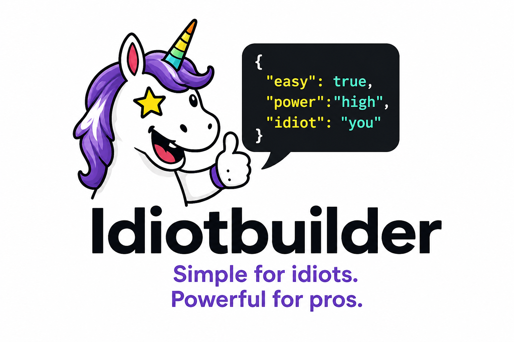
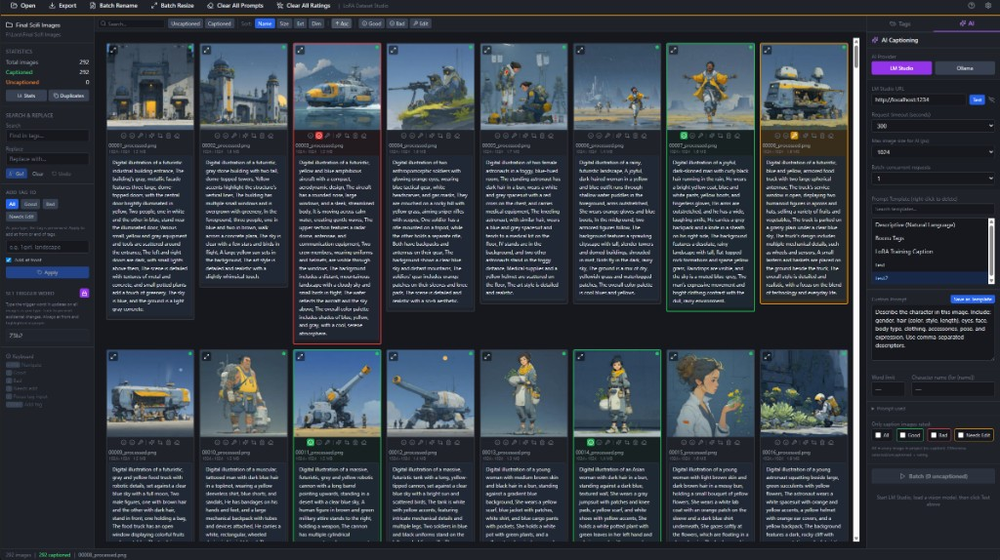

<p align="center">
  
</p>

# LoRA Dataset Studio

A desktop app for preparing image datasets for AI training (LoRA, DreamBooth, etc.). Tag and caption images, rate and curate them, crop for training, use local AI (LM Studio or Ollama), and export to folder or ZIP.




## Features

- **Grid & ratings** — Open a folder, rate images (Good / Bad / Needs Edit), virtualized grid for thousands of images. Multi-select with Ctrl+Click, Shift+Click range select, Ctrl+A select-all-visible; rate or delete the whole selection at once
- **Filtering & sorting** — Filter by rating, caption state, crop status, or search text; sort by name/size/dimensions
- **Tag editing** — Inline captions, right-panel tag editor, search/replace, trigger word (always kept first, including on AI-generated captions), add-tag-to-all with preview
- **AI captioning** — Built-in local captioner (one-click download of a Qwen3-VL vision model, runs fully offline on GPU via Vulkan or CPU), or connect to LM Studio / Ollama; single or batch; rating filter; Prose / Danbooru / e621 caption style presets; caption length control and 26 toggleable extra instructions (lighting, camera angle, shot type, PG vs. blunt language, refer-by-name, …)
- **Preview & crop** — Full-size view with zoom, prev/next; crop tool with flip/rotate, square output sizes (e.g. 512/1024), save-as-new, and multi-crop (several regions from one image). Per-image crop status tracking with grid filtering. Face detection (YuNet ONNX, downloaded on first use) auto-centers crops on faces.
- **Batch rename** — Rename image + caption pairs with a pattern and sequential numbering
- **Batch resize** — Resize / center-crop / fit to a target size (512/768/1024 presets) for all, selected, or Good-rated images; outputs to a folder with captions copied
- **Export** — Folder or ZIP; export all, selected, or by rating (good/bad/needs_edit subfolders); trigger word, sequential naming
- **Send to Fizgig** — Handoff to a local [Fizgig](https://github.com/shootthesound/Fizgig) install (LoRA training workbench): a dialog lets you name the dataset and choose what to include (by rating, all, or current selection), then exports images + captions into Fizgig's own `dataset/<name>` folder (cleared on each send so demoted images never linger), launches Fizgig, and copies the path to your clipboard for its Start tab. Set the Fizgig folder under Settings → Integrations.
- **Tools** — Find duplicates (SHA-256 content hash) with per-file delete and keep-largest actions, dataset stats, clear all tags (type "clear" to confirm), clear all ratings

## Performance

**Optimized for large datasets (500+ images):**
- Virtual scrolling for smooth rendering with thousands of images
- Disk-cached thumbnails served over the Tauri asset protocol (no base64 IPC)
- Optimistic UI updates for instant rating/caption changes
- Parallel file processing in Rust backend (rayon)
- Memoized React components to minimize re-renders

## Tech

- **Desktop:** [Tauri 2](https://v2.tauri.app/) (Rust + webview)
- **Frontend:** React 18, TypeScript, Vite, Zustand, TanStack Query, Tailwind
- **Performance:** Virtual scrolling (@tanstack/react-virtual), lazy loading, parallel processing (rayon)

## Prerequisites

- [Node.js](https://nodejs.org/) 18+ and npm
- [Rust](https://rustup.rs/) (stable)
- [Tauri prerequisites](https://v2.tauri.app/start/prerequisites/) for your OS (e.g. WebView2 on Windows, Xcode CLI on macOS)

The Tauri CLI is a dev dependency (`@tauri-apps/cli`), installed by `npm install` — no global install needed.

## Install & run

```bash
git clone https://github.com/Fablestarexpanse/Promptwaffle_LoRa_Organizer_Tagger.git
cd Promptwaffle_LoRa_Organizer_Tagger
npm install
npm run tauri dev
```

First build can take several minutes. Then:

```bash
npm run tauri build
```

Output: `src-tauri/target/release/bundle/` (installers for your platform).

## Where your data lives

Everything stays with your images — no database, no cloud:

- **Captions** — one sidecar `.txt` per image, same base name, comma-separated tags (Kohya/OneTrainer compatible)
- **Ratings** — `.lora-studio/ratings.json` inside the project folder (map of relative image path → rating)
- **Crop status** — `.lora-studio/crop_status.json` inside the project folder
- **Thumbnails** — JPEG cache in your OS temp dir (`lora-dataset-studio-thumbnails`); safe to delete, regenerated on demand

## AI captioning setup

### LM Studio

1. **Download:** [LM Studio](https://lmstudio.ai/) — free, run LLMs locally.
2. **Install** and open LM Studio.
3. **Get a vision model:** you need a model that supports images (search LM Studio's model hub for a quantized vision model).
4. **Load the model:** In Chat / Load Model, select the model and load it.
5. **Start server:** Open the **Local Server** tab, select your model, click **Start Server**. Default URL: `http://localhost:1234`.
6. **In the app:** AI tab → **LM Studio** → set URL (e.g. `http://localhost:1234`) → **Test** → pick model → **Generate Caption** or **Batch**.

**Links:** [LM Studio](https://lmstudio.ai/) · [Docs](https://lmstudio.ai/docs/) · [Model hub](https://lmstudio.ai/models)

### Ollama

1. **Download:** [Ollama](https://ollama.com/) — install for your OS.
2. **Pull a vision model:** e.g. `ollama pull llava` (or another [vision model](https://ollama.com/library)).
3. **In the app:** AI tab → **Ollama** → URL usually `http://localhost:11434/v1` → **Test** → pick model → **Generate Caption** or **Batch**.

**Links:** [Ollama](https://ollama.com/) · [Library](https://ollama.com/library)

### Tips

- Use a **vision** model (e.g. LLaVA, Llama 3.2 Vision); text-only models won't caption images.
- **Settings → Preview AI caption before saving** lets you accept/reject before overwriting.
- If captions time out: increase **Request timeout** in the AI panel, set **Max image size for AI** (e.g. 1024), or keep **Batch: concurrent requests** at 1.

## Usage

1. **Open** a folder of images.
2. **Edit tags** — click caption under an image or use the right panel.
3. **Rate** — Good / Bad / Needs Edit (or 1 / 2 / 3; with a multi-selection active, rates all selected images).
4. **AI** — Choose Built-in (local), LM Studio, or Ollama in the AI panel, then Generate Caption (single) or Batch. The built-in captioner offers a one-time model download (Qwen3-VL 8B or 4B) and runs fully offline.
5. **Export** — Export → choose what to export (all, selected, by rating, etc.) → pick destination.
6. **Train** — Send to Fizgig: name the dataset, pick what to include (by rating / all / selection), and it exports into Fizgig's `dataset/<name>` folder and launches Fizgig with the path on your clipboard (set its folder in Settings → Integrations first).

### Shortcuts

| Action              | Shortcut        |
|---------------------|-----------------|
| Navigate grid       | Arrow keys      |
| First / last        | Home / End      |
| Multi-select        | Ctrl+Click      |
| Range select        | Shift+Click     |
| Select all visible  | Ctrl+A          |
| Clear selection     | Escape          |
| Preview             | Enter / double-click |
| Select tile         | Space           |
| Rate                | 1 / 2 / 3 (applies to the whole selection when multi-selected) |
| Focus tag input     | T               |
| Undo / redo (tags)  | Ctrl+Z / Ctrl+Y |
| Close dialog        | Escape          |
| Zoom (preview)      | + / −           |
| Prev/next (preview) | ← / →           |
| Nudge crop box      | Arrow keys (crop tool) |
| Apply crop          | Ctrl+Enter (crop tool) |
| Save crop as new    | S (crop tool)   |

## Caption format

One `.txt` per image, same base name; comma-separated tags (e.g. Kohya/OneTrainer compatible):

```
image001.png
image001.txt  →  "trigger_word, tag1, tag2, ..."
```

## Architecture

```
src/                    — React app
  components/           — UI by feature (grid, editor, preview, ai, export, rename, filter, layout, …)
  stores/               — Zustand stores (project, selection, filter, settings, ai, crop, history, ui, …)
  hooks/                — useProject (react-query image list), shortcuts, focus trap
  lib/                  — tauri.ts (all backend invoke wrappers), thumbnail sizing, filtering, prompt builder
src-tauri/              — Rust backend
  src/commands/         — one module per feature: project, images (thumbnails/crop/resize),
                          captions, ratings, crop_status, export, batch_rename,
                          lm_studio, ollama, detect (YuNet face detection),
                          models (built-in model downloads), llama_server (local captioner)
```

The frontend never touches the filesystem directly — every operation goes through a Tauri command (`src/lib/tauri.ts` documents the full command list and payload conventions). Heavy work (image decode, hashing, zipping) runs in Rust on blocking threads; thumbnails are written to a disk cache and loaded by the webview through the asset protocol.

## License

MIT — see [LICENSE](LICENSE).
